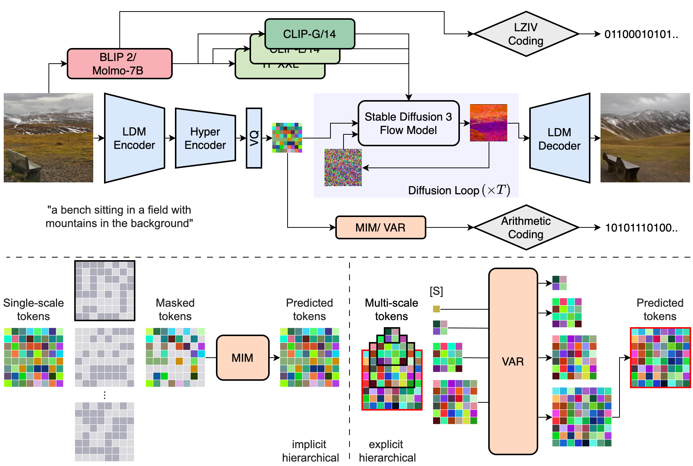

# PerCoV2 (PyTorch)

> **PerCoV2: Improved Ultra-Low Bit-Rate Perceptual Image Compression with Implicit Hierarchical Masked Image Modeling**  
> Nikolai Körber, Eduard Kromer, Andreas Siebert, Sascha Hauke, Daniel Mueller-Gritschneder, Björn Schuller  
> ArXiv TODO

## Abstract

We introduce PerCoV2, a novel and open ultra-low bit-rate perceptual image compression system designed for bandwidth- and storage-constrained applications. Building upon prior work by Careil et al., PerCoV2 extends the original formulation to the Stable Diffusion 3 ecosystem and enhances entropy coding efficiency by explicitly modeling the discrete hyper-latent image distribution. To this end, we conduct a comprehensive comparison of recent autoregressive methods (VAR and MaskGIT) for entropy modeling and evaluate our approach on the large-scale MSCOCO-30k benchmark. Compared to previous work, PerCoV2 (i) achieves higher image fidelity at even lower bit-rates while maintaining competitive perceptual quality, (ii) features a hybrid generation mode for further bit-rate savings, and (iii) is built solely on public components. Code and trained models will be released at [https://github.com/Nikolai10/PerCoV2](https://github.com/Nikolai10/PerCoV2).

