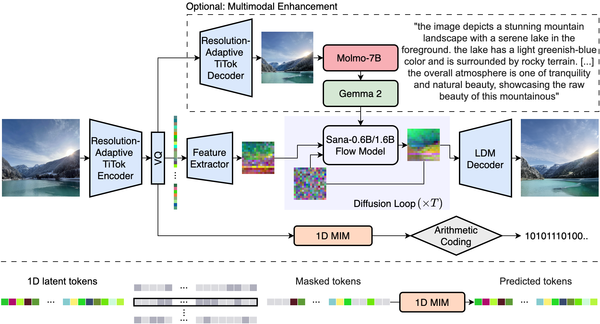

# PerCoV2 (PyTorch)

> **PerCoV2: Ultra-Low Bit-Rate Perceptual Image Compression via Query-Based 1D Multimodal Image Tokens**  
> Nikolai Körber, Eduard Kromer, Andreas Siebert, Sascha Hauke, Daniel Mueller-Gritschneder, Björn Schuller  
> ArXiv TODO

## Abstract

Despite recent progress in learned image compression, current image codecs still struggle to maintain realistic reconstructions at low bit-rates, often producing structured artifacts such as grid patterns or repetitive textures, even when trained with perceptual or adversarial losses. In this work, we introduce PerCoV2, an ultra-low bit-rate perceptual image compression system that unifies semantic tokenization, flow-based generation, and learned entropy modeling within a single framework. Building on the fully open flow-based SANA architecture, PerCoV2 introduces a novel resolution-adaptive 1D query-based tokenizer whose compact image tokens serve a dual role in flow matching: they provide a data-dependent reconstruction prior for initialization while simultaneously acting as a conditioning signal for flow-based refinement. By explicitly decoupling semantic representation from perceptual generation, our dual representation simplifies the flow-based learning objective, leading to more stable optimization and improved perceptual compression performance. PerCoV2 further introduces a dedicated 1D masked entropy model to improve rate efficiency and optional decoder-side multimodal enhancement via a vision–language model (Molmo) without increasing the transmitted bit budget. On MSCOCO-30k, PerCoV2 achieves state-of-the-art statistical fidelity, measured by FID and KID, across ultra-low and extreme bit-rates (0.0015–0.025 bpp). When trained solely on the general-purpose SA-1B dataset, PerCoV2 further demonstrates strong zero-shot generalization to widely adopted high-resolution benchmarks, including DIV2K and CLIC 2020, achieving competitive statistical fidelity with the current leading method, AEIC-ME. Finally, we introduce PerCoV2-distilled, a practical single-step variant derived from multi-step flow matching that accelerates decoding by 5.37x over PerCoV1, while preserving perceptual compression performance. Code and pre-trained models will be released upon publication at [https://github.com/Nikolai10/PerCoV2](https://github.com/Nikolai10/PerCoV2).

